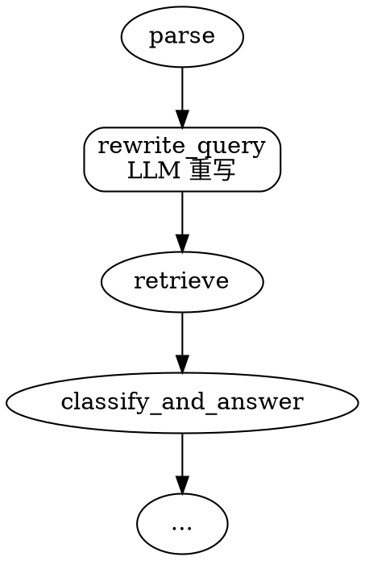

# 对话式 RAG 查询重写设计

## 问题

在多轮对话中，用户的后续问题往往依赖上文的语境。例如：

```
用户: Python dict 是什么？
助手: Python dict 是无序的键值对集合...
用户: Java Map 和它的区别？
```

将"Java Map 和它的区别"直接用于向量检索，会丢失"Python dict"这个关键上下文，导致检索不到相关的 Python 文档。

需要一种机制，在检索前将依赖上下文的提问重写为独立的、可检索的查询语句。

## 方案概览

在 `parse → retrieve` 之间插入 `rewrite_query` 节点，用 LLM 结合对话历史将用户追问改写为独立问题。改写后的查询存入 `state["search_query"]`，所有下游检索统一使用该字段，`user_message` 保留原句用于回答链路。

同时引入按任务选择模型的机制，为不同场景（改写、分类、蒸馏）配置不同模型。

## 架构



### 查询路径

| 用途 | 使用字段 | 说明 |
|---|---|---|
| 向量检索（knowledge_points） | `search_query` | retrieve 节点 |
| 错误记录检索 | `search_query` | error_records 检索 |
| Episode 记忆检索 | `user_message` | Episodic 存储的是独立对话摘要，上下文依赖影响很小 |
| Agent 回答 | `user_message` | classify_and_answer 节点 |
| 知识存储 | `user_message` | store 节点 |
| 对话历史记录 | `user_message` | message_history.add_message |

## 变更清单

### 1. AgentState 增加字段

在 `agent/state.py` 中添加：

```
search_query: str  # LLM 重写后的独立查询语句
```

`parse` 节点不变，`search_query` 在初始 invoke 时设为空字符串。

### 2. 新增 rewrite_query 节点

文件：`agent/nodes/rewrite_query.py`

逻辑：

1. 从 `state["session_id"]` 获取 `MessageHistory.get_recent()`（最近 6 条）
2. 如果历史不足 2 条（只有当前消息）→ 直接返回 `user_message` 作为 `search_query`
3. 否则，调用 `LLM.get_model_for("rewrite")` 执行改写
4. 如果 LLM 失败 → fallback 到原句

LLM Prompt：

```
你是一个查询改写助手。根据对话历史，将用户的最新问题改写为一个
不需要上下文就能理解的独立问题。

要求：
- 补全指代（"它"→"Python dict"、"区别呢"→"A和B的区别"）
- 补全省略的部分
- 不要添加不存在的信息
- 如果问题已经是独立的，保持原文
- 只输出改写后的文本，不要任何解释

对话历史：
{history}

用户最新消息：{message}
```

### 3. Graph 变更

在 `agent/graph.py` 中：

- 注册 `rewrite_query` 节点
- 边：`"parse" → "rewrite_query"` → 原 `"parse" → "retrieve"` 改为 `"rewrite_query" → "retrieve"`

### 4. 下游检索调用点修改

| 文件 | 修改内容 |
|---|---|
| `agent/nodes/retrieve.py` | `query = state.get("search_query") or state["user_message"]` |

### 5. 模型选择机制

在 `agent/utils/llm.py` 中增加：

```
@classmethod
def get_model_for(cls, task: str, temperature: float | None = None):
    """根据任务名获取模型实例。task 在 TASK_MODEL_MAP 中配置。"""
```

在 `server/config.py` 中增加：

```
TASK_MODEL_MAP: dict[str, str] = {
    "default": LLM_MODEL,
    "rewrite": LLM_MODEL,  # 后续可换为轻量模型
}
```

未注册的任务回退到 `LLM_MODEL`，保证向后兼容。

### 6. 错误处理

| 场景 | 行为 |
|---|---|
| 新会话（无历史） | 跳过 LLM，直接返回原句 |
| LLM 超时/异常 | `try/except` → fallback 到原句，打 warning 日志 |
| 重写后为空字符串 | fallback 到原句 |

## 涉及文件

| 文件 | 操作 |
|---|---|
| `agent/state.py` | + 字段 `search_query` |
| `agent/nodes/rewrite_query.py` | **新建** |
| `agent/graph.py` | + 节点注册 + 边 |
| `agent/nodes/retrieve.py` | 修改 query 来源 |
| `agent/utils/llm.py` | + `get_model_for(task)` |
| `server/config.py` | + `TASK_MODEL_MAP` |

## 不需要改的

- `classify_and_answer` 节点 — 仍用 `user_message`
- `store` 节点 — 仍用 `user_message`
- `parse` 节点 — 不变
- `bot.py` — 不变（graph 内部处理）
- `storage/models.py` — 本次不涉及 error_records 层面的修改
