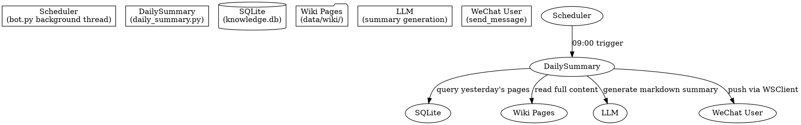

# Daily Knowledge Summary Design

> 每天早上 9:00 定时汇总前一天新增/更新的 wiki 页面，通过 LLM 生成结构化的知识日报，主动推送到企业微信。

## Architecture



## Source Question Mapping

The `sources` field in frontmatter stores source IDs like `conv_20260514_091532`, but does not preserve the original user question. To show "what question triggered this page" in the daily summary, add a lightweight mapping table:

**New DB table `source_questions`:**
- `source_id` TEXT PRIMARY KEY — e.g. `conv_20260514_091532`
- `question` TEXT — the original user message
- `created_at` TEXT — when this mapping was created

**Modification in `store.py`:** After `_get_source_id()`, save the mapping before calling `extract_to_wiki()`:
```python
source_id = _get_source_id()
_source_questions.save(source_id, state["user_message"])  # new
```

This is a simple INSERT OR IGNORE — no need to update existing records.

## Components

### 1. `server/daily_summary.py` — New Module

Single public async function:

```python
async def send_daily_summary(client: WSClient, user_id: str) -> bool
```

**Internal flow:**

```
send_daily_summary()
  ├─ _get_yesterday_pages() → list[dict]
  │   ├─ Query DB: WHERE (created_at >= Y 00:00 AND created_at < T 00:00)
  │   │          OR (updated_at >= Y 00:00 AND updated_at < T 00:00)
  │   ├─ For each, read page content from disk (data/wiki/pages/xxx.md)
  │   ├─ Parse frontmatter for: title, tags, sources, created, updated
  │   └─ Return structured list
  │
  ├─ _generate_summary_text(pages) → str (markdown)
  │   ├─ Build prompt with page titles, summaries, source conversations
  │   ├─ LLM.generate_structured() → structured summary
  │   └─ Format as markdown with sections: 新增/更新/ unchanged(本周趋势)
  │
  └─ client.send_message(user_id, {"msgtype":"markdown","markdown":{"content": ...}})
```

### 2. `server/bot.py` — Modification

Use APScheduler (`AsyncIOScheduler`) to schedule the daily summary with a cron trigger:

```python
from apscheduler.schedulers.asyncio import AsyncIOScheduler

class KnowledgeBot:
    def __init__(self):
        self.client = WSClient(...)
        self.scheduler = AsyncIOScheduler()
        self._setup_handlers()

    def _start_daily_summary_scheduler(self):
        if not DAILY_SUMMARY_ENABLED:
            return
        self.scheduler.add_job(
            send_daily_summary,
            "cron",
            hour=9, minute=0,
            args=[self.client, DAILY_SUMMARY_USER_ID],
            misfire_grace_time=300,  # 5分钟内补跑
        )
        self.scheduler.start()
        logger.info("Daily summary scheduler started (09:00)")

    def run(self):
        self.client.run()  # blocking
```

Add `apscheduler` to `requirements.txt`.

### 3. `server/config.py` — New config

Add:
- `DAILY_SUMMARY_ENABLED` (bool, default True)
- `DAILY_SUMMARY_USER_ID` (str, the target WeChat user ID)
- `DAILY_SUMMARY_TIME` (str, default "09:00")

## Data Flow

```
Scheduler (09:00)
    ↓
query yesterday pages from DB
    ↓ (empty check → skip, log "no new knowledge yesterday")
    ↓
read page content from disk
    ↓
look up source questions (JOIN source_questions ON sources LIKE '%source_id%')
    ↓
build prompt with page content + source questions → LLM generates structured summary
    ↓ (LLM fails → log error, no message sent)
    ↓
format as markdown
    ↓
client.send_message(chatid=user_id, body=markdown)
    ↓ (send fails → log error, no retry)
    ↓
log success
```

## Query Logic

```sql
-- Yesterday's range: 2026-05-13 00:00:00 ~ 2026-05-14 00:00:00
SELECT id, title, file_path, tags, sources, created_at, updated_at
FROM pages
WHERE status = 'active'
  AND (created_at >= ? AND created_at < ?)
     OR (updated_at >= ? AND updated_at < ?)
ORDER BY created_at DESC
```

Pages are split into two lists:
- **New**: `created_at` falls within yesterday (page was created yesterday)
- **Updated**: `created_at` is before yesterday, but `updated_at` falls within yesterday

After querying pages, for each page parse its `sources` field (JSON list), extract `conv_*` source IDs, and look up corresponding questions from `source_questions` table:

```python
for page in pages:
    source_ids = json.loads(page["sources"])
    questions = conn.execute(
        "SELECT question FROM source_questions WHERE source_id IN (?)",
        (source_ids,)
    ).fetchall()
    page["source_questions"] = [q[0] for q in questions]
```

## Prompt for LLM Summary

The generation prompt includes:
- Yesterday's date range
- List of new pages with title + content preview (first 500 chars)
- List of updated pages with title + brief change description
- List of source conversations (from frontmatter `sources` field)
- Output format: markdown with sections

The LLM is instructed to:
1. Group related pages together (e.g., TCP 三次握手 + TCP 状态转换 + SYN Flood)
2. For each page, include what question triggered its creation
3. Write in Chinese, keep technical terms in English
4. Use emoji section headers (📌 新增, 📝 更新)

## Edge Cases

| Scenario | Behavior |
|----------|----------|
| No new/updated pages yesterday | Skip, log "no new knowledge", no message sent |
| LLM generation fails | Log error, no message, next day retries fresh |
| Network error sending message | Log error, no retry |
| Bot not running at 09:00 | Missed summary, next day catches up |
| Page updated multiple times same day | Deduplicated by page ID |
| New page created then updated same day | Counted as "new" (not duplicated in "updated") |

## Files Modified

| File | Change |
|------|--------|
| `server/daily_summary.py` | **Create** — core logic (query + generate + send) |
| `server/bot.py` | **Modify** — add scheduler thread in `KnowledgeBot.run()` |
| `server/config.py` | **Modify** — add DAILY_SUMMARY_* config vars |
| `agent/nodes/store.py` | **Modify** — save source_id→question mapping |
| `storage/database.py` | **Modify** — add `source_questions` table creation |
| `requirements.txt` | **Modify** — add `apscheduler` |

## Testing

- `test_get_yesterday_pages_empty` — No pages yesterday → empty list
- `test_get_yesterday_pages_found` — Pages created/updated yesterday → correct list
- `test_generate_summary_text` — Mock LLM → verify markdown format
- `test_send_daily_summary_skips_when_empty` — Empty pages → no send
- `test_source_questions_saved_on_store` — Store node saves source question mapping
- `test_source_questions_lookup` — Query source_questions table returns correct questions
