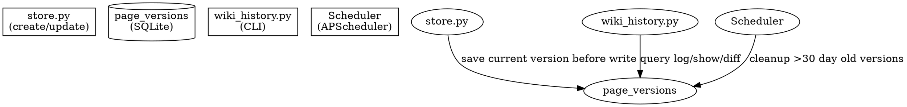

# Wiki Revision History Design

> 类似 Git 的 wiki 页面版本管理：每次修改保存完整快照，支持历史查看、版本对比、定时清理。

## Architecture



## Source Question Integration

Remove `source_questions` table. The user question text is directly embedded in `page_versions.source_question`, eliminating the need for a separate lookup table and JOIN queries when viewing revision history.

## Database Schema

### New: `page_versions` table

```sql
CREATE TABLE IF NOT EXISTS page_versions (
    id INTEGER PRIMARY KEY AUTOINCREMENT,
    page_id INTEGER NOT NULL,
    version INTEGER NOT NULL,
    title TEXT NOT NULL,
    content TEXT NOT NULL,
    checksum TEXT NOT NULL,
    source_id TEXT DEFAULT '',
    source_question TEXT DEFAULT '',
    change_summary TEXT DEFAULT '',
    created_at TEXT NOT NULL DEFAULT (datetime('now', 'localtime')),
    FOREIGN KEY (page_id) REFERENCES pages(id),
    UNIQUE(page_id, version)
);
```

### Removed: `source_questions` table

The existing `source_questions` table is dropped in favor of embedding the question text directly in `page_versions`.

## Version Management

### Save Strategy

In `store.py` → `extract_to_wiki()`, before overwriting a page file:

1. Read existing page content from disk
2. If content exists (update), save it as a new version entry in `page_versions`
3. Increment version number (auto: `SELECT COALESCE(MAX(version), 0) + 1 FROM page_versions WHERE page_id = ?`)
4. Write the new content to disk
5. No version save needed for first-time creates (content is brand new)

### Version Numbering

Auto-increment per `page_id`. Version 1 = created, then monotonically increasing.

### Data Flow

```
generate new content
  → check if page exists on disk
    → if exists: save old content as page_versions version N+1
    → if not exists: version starts at 1 on first write
  → write_page() with new content
  → upsert_page() to update index
  → rebuild_index()
```

## Query Interface

A lightweight CLI tool `wiki_history.py` with three subcommands:

### `python wiki_history.py log <title>`
Show version history for a page, most recent first.

```
v3 | 2026-05-14 15:30 | 更新 | 来源: conv_20260514_153000 | "TCP四次挥手"
v2 | 2026-05-13 20:00 | 更新 | 来源: conv_20260513_200000 | "TCP状态转换"
v1 | 2026-05-13 10:00 | 新建 | 来源: conv_20260513_091532 | "TCP三次握手的过程"
```

### `python wiki_history.py show <title> [version]`
Display the full page content at a specific version. If version omitted, show latest.

### `python wiki_history.py diff <title> <v1> <v2>`
Unified diff between two versions using Python's `difflib.unified_diff`.

Output format:
```diff
--- TCP三次握手 v1
+++ TCP三次握手 v2
@@ -1,5 +1,7 @@
-TCP三次握手是建立连接的过程
+TCP三次握手是建立可靠连接的过程
+第三步客户端发送ACK确认
```

## Integration Points

### `agent/nodes/store.py`

Modified save flow in `extract_to_wiki()`:

```python
for wp in batch.pages:
    # ... existing logic to build content ...

    # New: Save current version before overwriting
    existing = read_page(file_path)
    if existing:
        _save_version(
            page_id=pid,
            title=wp.title,
            content=full_content,  # old content about to be replaced
            source_id=source_id,
            source_question=source_label.replace("Question: ", ""),
        )

    # ... existing write_page(), upsert_page() ...
```

Note: The first time a page is created, there's no old content to save. Version 1 is implicitly the first write.

### `server/daily_summary.py`

Instead of querying `source_questions` table, read `source_question` from the latest `page_versions` entry for each page.

Current `_get_yesterday_pages()` change:
- Remove `get_source_questions()` import and call
- Replace with: `SELECT source_question FROM page_versions WHERE page_id = ? ORDER BY version DESC LIMIT 1`

### `server/bot.py`

Add a new APScheduler cron job in `KnowledgeBot`:

```python
self.scheduler.add_job(
    cleanup_old_versions,
    "cron",
    hour=3,
    minute=0,
    id="wiki_cleanup",
    replace_existing=True,
)
```

### `storage/models.py`

Add new helper functions:

```python
def save_page_version(page_id, title, content, checksum, source_id, source_question):
    """Insert a new version record. Auto-increments version number."""

def get_page_versions(page_id, limit=20):
    """List versions for a page, most recent first."""

def get_page_version(page_id, version):
    """Get specific version content."""

def cleanup_old_versions(days=30):
    """Delete versions older than N days, keeping at least 1 per page."""
```

Remove `save_source_question()` and `get_source_questions()`.

## Cleanup Strategy

- Runs daily at 03:00 via APScheduler
- Deletes `page_versions` rows where `created_at < (now - 30 days)`
- Enforces at least 1 version per page: if all versions would be deleted, keeps the newest one
- Idempotent, safe to run multiple times

```sql
DELETE FROM page_versions WHERE created_at < ? AND id NOT IN (
    SELECT pv.id FROM page_versions pv
    INNER JOIN (
        SELECT page_id, MAX(id) as max_id
        FROM page_versions
        GROUP BY page_id
    ) latest ON pv.id = latest.max_id
);
```

## Edge Cases

| Scenario | Behavior |
|----------|----------|
| Page updated 3 times in 1 minute | 3 separate versions saved |
| Page created and immediately updated in same Q&A | First write → v1, update → v2 |
| cleanup runs on empty page_versions | No-op, log warning |
| wiki_history.py for non-existent page | Error message "page not found" |
| Diff across version 1 and version that was cleaned up | Error message "version not available" |
| source_question is empty (e.g. manual edit) | Display as "未知来源" |

## Files Modified

| File | Change |
|------|--------|
| `storage/database.py` | **Modify** — add `page_versions` table, remove `source_questions` table |
| `storage/models.py` | **Modify** — add version helpers, remove source_question helpers |
| `agent/nodes/store.py` | **Modify** — save version before overwrite |
| `server/daily_summary.py` | **Modify** — read `source_question` from `page_versions` |
| `server/bot.py` | **Modify** — add cleanup cron job at 03:00 |
| `wiki_history.py` | **Create** — CLI for log/show/diff |
| `tests/unit/` | **Modify** — update affected tests |

## Testing

- `test_save_version_new` — First version saved for a page
- `test_save_version_increments` — Version number auto-increments per page
- `test_get_page_versions` — Returns correct versions in order
- `test_cleanup_old_versions` — Versions older than 30 days removed
- `test_cleanup_keeps_at_least_one` — Enforced minimum one version per page
- `test_wiki_history_log` — CLI log output format
- `test_wiki_history_show` — CLI show returns correct content
- `test_wiki_history_diff` — CLI diff produces unified diff
- `test_daily_summary_source_question` — Reads from page_versions correctly
- `test_store_saves_version_on_update` — Store node creates version before overwrite
